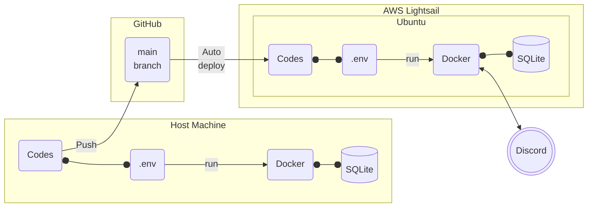
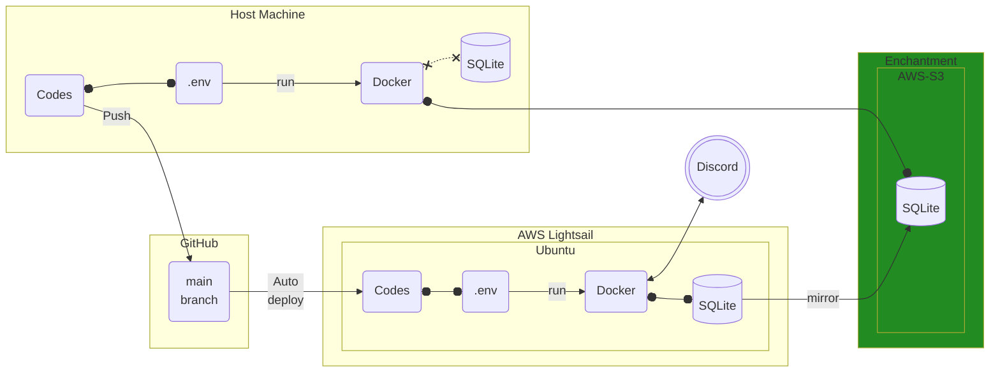

<samp>
<p align="center">

</p>

# <p align="center">🐙 Takohachi 🐙</p>

<p align="center"><a href="https://github.com/search?q=repo%3Apistachiostudio%2Ftakohachi++language%3APython&type=code"></a> <a href="https://github.com/pistachiostudio/takohachi/actions"></a> <a href="https://github.com/pistachiostudio/takohachi/issues"></a> <a href="https://discord.gg/pistachiogaming"></a> <a href="https://open.vscode.dev/pistachiostudio/takohachi"></a></p>

<p align="center">Takohachi is useless Discord bot.<br>But he has romance.</p>

## 🐙 About

これは[ピスタチオゲーム部親睦会](https://discord.gg/pistachiogaming)というDiscordサーバーのためのユースレスBotです。

## ⚙ Functions

https://github.com/pistachiostudio/takohachi/tree/main/src/cogs

## 🪂 installing Packages & Dependencies

### With Poetry

```bash
$ poetry install
```

### With pip

```bash
$ pip install -r requirements.txt
```

## 🏭 Auto deployment by GitHub Actions

- [.github/workflows/deploy.yml](https://github.com/pistachiostudio/takohachi/blob/master/.github/workflows/deploy.yml)
- Required secrets:
  - Server IP
  - Server Port
  - Server User
  - Sever SSH Key
  - Directory to deploy

## 🌊 Takohachi inhabits Lightsail

### Now



### Future Enchantment



## 🐳 Docker

### 1. Clone this repository

```bash
$ git clone https://github.com/pistachiostudio/takohachi.git
```

### 2. Create `.env` file on the root directory

```bash
OPENAI_API_KEY=''
TOKEN=''
PREFIX='!!'
CARDCOUNT_KEY=''
CLIENT_SECRET=''
DATABASE_URL=''
DIC_KEY=''
DRIVE_FOLDER_ID=''
GOOGLE_APPLICATION_CREDENTIALS=''
INU_VC_ID=''
NEKO_VC_ID=''
KAME_VC_ID=''
KYORYU_VC_ID=''
LOG_TEXT_CHANNEL_ID=''
SPOTIFY_CLIENT_ID=''
SPOTIFY_CLIENT_SECRET=''
SSLADD_KEY=''
TAKOHACHI_JSON=''
TRN_API_KEY=''
```

### 3. Run

```bash
$ docker compose up -d
```

🔫 Yeah_bot_is_on_ready!!

## 🎨 Icons
| by [Go Inagaki](https://hodwn.com/go-inagaki/)                                                                                 | by [Imoya](https://twitter.com/arakudai2)                                                                                      |
| ------------------------------------------------------------------------------------------------------------------------------ | ------------------------------------------------------------------------------------------------------------------------------ |
|  |  |


## 🐕 Pistachio Studio

川崎のヒップホップ/録音/プロデューサーチーム。ヒップホップクルー = [CBS](https://youtu.be/A3oshdbRbBI)とそのバックバンドChicken Is Niceを中心に15年以上活動中。
全員30超え、仕事あり、家庭あり、ガキもあり、ペットもあり、かなり限界ながらも活動中。
[chelmico](https://www.youtube.com/watch?v=76sNmqMzUuI)というラップユニットの裏方や、シンガーソングライター [iri](https://www.youtube.com/watch?v=3WlOZTy072k)のプロデュースなどもやっています。
[**ピスタチオゲーム部親睦会**](https://discord.gg/6XbCyRF)はPistachio Studioのメンバーが中心となって発足したエンジョイゲームコミュニティです。

## 🔗 Links

- [Pistachio Studio home](https://pistachiostudio.net/)
- [Instagram](http://instagram.com/pistachiostudio)
- [Twitter](https://twitter.com/pstchstd)
- [YouTube](https://www.youtube.com/c/pistachiostudiokngw)
- [Soundcloud](https://soundcloud.com/pistachio-studio)
- [Spotify Playlist](https://open.spotify.com/user/2wf7ulo34ef46fu3awnq984wj?si=mm3fQfatR1OF2Kgr_uieGw)

## 🤝 License

Takohachi is released under the MIT license.
©2023 Pistachio Gaming & Pistachio Studio.

</samp>
