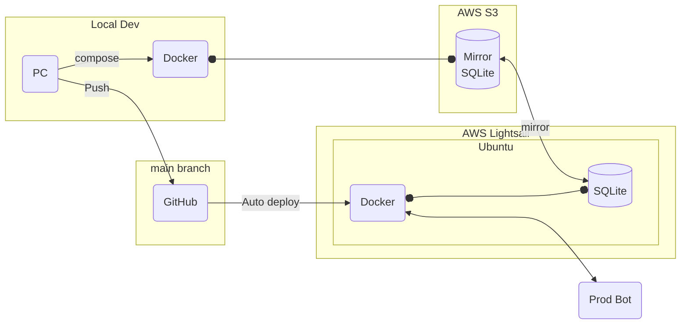

## Future image

```mermaid

flowchart LR
Z(PC)
A(Docker)
B(GitHub)
C(Docker)
D[(SQLite)]
E[(Mirror<br>SQLite)]
F(Prod Bot)

subgraph Local Dev
Z
A
end

subgraph AWS Lightsail
subgraph Ubuntu
C
D
end
end

subgraph main branch
B
end

subgraph AWS S3
E
end
Z -- compose --> A
Z -- Push --> B
B -- Auto deploy --> C
C o---o  D
C <---> F
E <-- mirror --> D
A o---o E
```