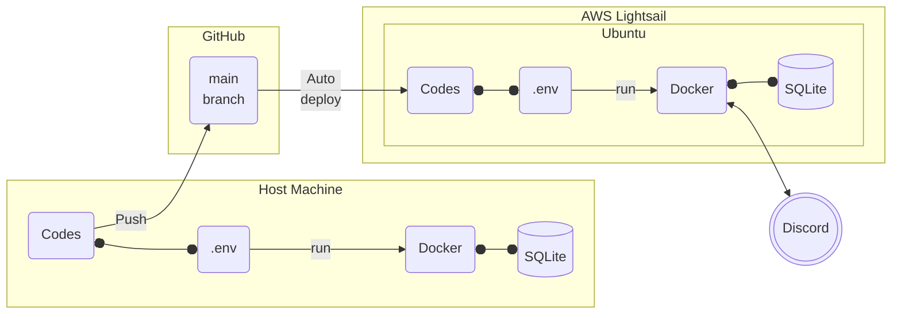
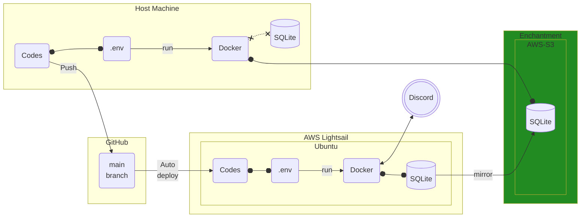

### Now

```mermaid
flowchart LR

Z(Codes)
A(Docker)
B(main<br>branch)
C(Docker)
D[(SQLite)]
F(Codes)
G[(SQLite)]
H(.env)
I(.env)
J(((Discord)))

subgraph Host Machine
Z
G
A
H
end

subgraph GitHub
B
end

subgraph AWS Lightsail
subgraph Ubuntu
C
D
F
I
end
end

Z o--o H
H -- run --> A
Z -- Push --> B
A o--o G
B -- Auto<br>deploy --> F
F o--o I
I -- run --> C
C o--o  D
C <--> J
```

### Future Enchantment

```mermaid

flowchart LR

Z(Codes)
A(Docker)
B(main<br>branch)
C(Docker)
D[(SQLite)]
F(Codes)
G[(SQLite)]
H(.env)
I(.env)
J[(SQLite)]
K(((Discord)))


subgraph Host Machine
Z
G
A
H
end

subgraph GitHub
B
end

subgraph AWS Lightsail
subgraph Ubuntu
C
D
F
I
end
end

subgraph Enchantment
subgraph AWS-S3
J
end
end
style Enchantment fill:forestgreen
style AWS-S3 fill:forestgreen

Z o--o H
H -- run --> A
Z -- Push --> B
A o--o J
B -- Auto<br>deploy --> F
F o--o I
I -- run --> C
C o--o  D
D -- mirror --> J
A x-.-x G
C <--> K
```
